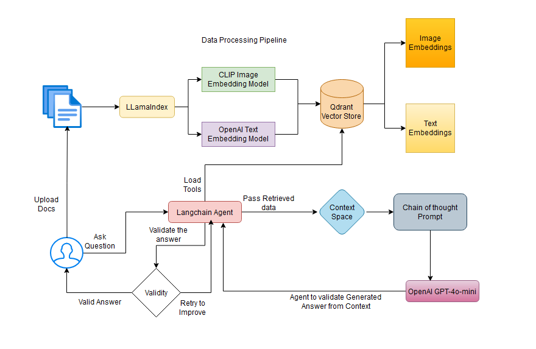

# Introduction 
- DARI - Data Analysis for Real-time Insights 
DARI built on a robust foundation combining LlamaIndex and LangChain, two powerful frameworks in the AI space. To test please ensure to use only images in JPG format and .txt files.
Core Components
    - LlamaIndex: We chose LlamaIndex as the backbone for our data ingestion and Retrieval-Augmented Generation (RAG) pipeline. Its efficiency in handling and indexing large datasets made it an ideal choice for our analytical needs.
    - LangChain: This framework powers our agent interaction design. We implemented temporary chat memory and tool access, enabling the agent to maintain context and perform complex operations.

# HighLevel Architecture

# Decision Flow
The agent's decision graph is designed to optimize analytical query handling:
    1.	Query Classification: The agent first determines if the user's query is analytical in nature.
    2.	Non-Analytical Queries: For non-analytical questions, the agent politely guides the user to rephrase their query.
    3.	Analytical Queries: The agent creates a detailed execution plan and follows it step-by-step.
    4.	Context Retrieval: Utilizes both image and text embeddings to gather relevant context.
    5.	Answer Generation: GPT-40-mini generates an initial response.
    6.	Validation: The agent validates the answer against the user query and retrieved context.
    7.	Iteration: If necessary, the agent can reiterate the retrieval process to improve the answer.

# Key Technologies
    •	Qdrant: Chosen as vector database for its performance in handling embeddings.
    •	CLIP: An open-source model used for image embeddings, crucial for generating image embedding. In production Nomic embeddings would be the go-to model.
    •	OpenAI ada-002: Employed for generating text embeddings, ensuring high-quality text analysis.
    •	Streamlit: Selected for the frontend due to its simplicity and effectiveness in creating data apps.
# Scaling Considerations
    To handle larger datasets (e.g., 2,000 or 20,000 comments), we can implement the following strategies:
    1.	Database Storage: Comments are stored in a scalable database system such are Postgres.
    2.	Preprocessing Pipeline: Create a pipeline that handles:
    •	Metadata creation
    •	Sentiment analysis
    •	Translations (if needed)
    3.	Incremental Indexing: Only the latest data is indexed to speed up the embedding process.
    4.	Batch Processing: Implement for efficient handling of large datasets.
    5.	Asynchronous Calls: Used for Qdrant during indexing and retrieval to improve performance.
    6.	Metadata Optimization: Enhances retrieval efficiency for large datasets.
# Deployment Strategy
    Our deployment approach focuses on scalability, maintainability, and performance:
    1.	Package Management: Poetry is used for managing package dependencies, ensuring consistent environments.
    2.	Containerization: Docker is employed to build images, facilitating easy deployment and scaling.
    3.	Cloud Hosting: Azure App Service is my chosen platform, offering:
        •	Seamless integrations
        •	CI/CD pipeline setup
        •	Easy scaling options based on user load
    4.	Performance Monitoring: Tools like Langfuse or Langsmith can be integrated to monitor app performance.
    5.	Multi-User Support: To handle multiple concurrent users:
        •	We implement request queuing and load balancing
        •	Utilize Azure's auto-scaling features to dynamically adjust resources
        •	Implement caching mechanisms to reduce redundant computations
        •	Use database connection pooling to optimize database interactions

# Getting Started
Setting up the Agent
1.	Download the zip file or clone from git repo
2.	Create a virtual env using conda or any python virtual env managers
3.	Rename the evn_exmaple file to .env and add your OpenAI api key and Qdrant url and api key
4.	You can get your API Keys here
    - OpenAI API: https://platform.openai.com/docs/overview
    - Qdrant API: https://cloud.qdrant.io/login

# Build and Test
- To run the Agent locally:
    - Open the teminal and navigate to the downloaded code repo
    - Activate the virtual env 
    - Navigate to dataAalyst-agent using 
        - cd dataAalyst-agent
        - run *poetry install*
        - run *poetry run streamlit run dataanalyst_agent/main.py*
- Alternatively you can also build the docker image locally
    - Open the teminal and navigate to the downloaded code repo
    - run *docker build -t image_name:tag_name .*
    - run *docker run image_name:tag_name*
- To run the Docker image in Azure App Service
    - Open the teminal and navigate to the downloaded code repo
    - Builing Docker image for linux amd platform
        - *docker build --platform linux/amd64 -t image_name:tag_name .* 
    - Login to az container registory
        - *docker login devassistants.azurecr.io --username [your username]*
    - Tag the image
        - *docker tag image_name:tag_name devassistants.azurecr.io/image_name:tag_name*
    - Push the image to acr
        - *docker push devassistants.azurecr.io/image_name:tag_name*
# Contribute

If you want to know more about creating similar agent feel free to contact me @ contact.sagargr@gmail.com 
This repo is only for Educational purpose and stricly not for production use.
